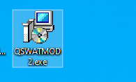
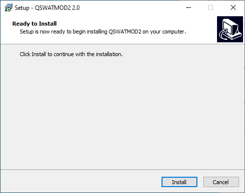
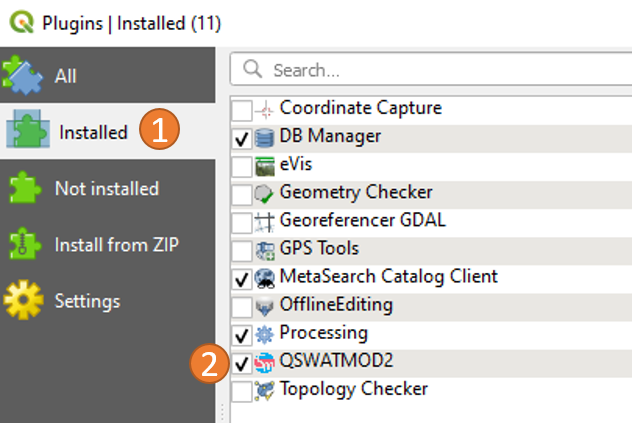
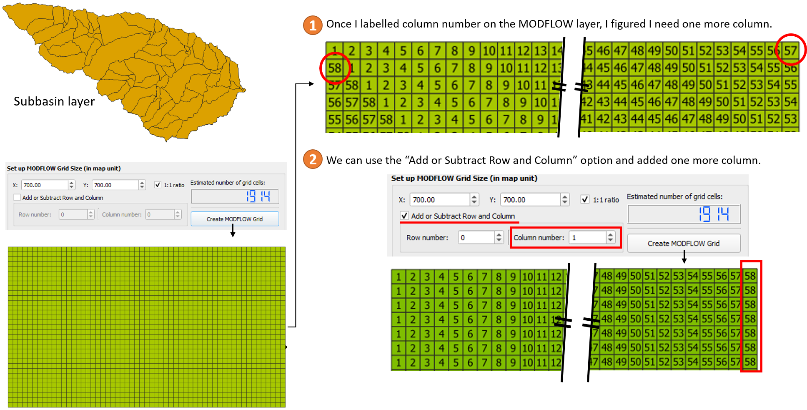
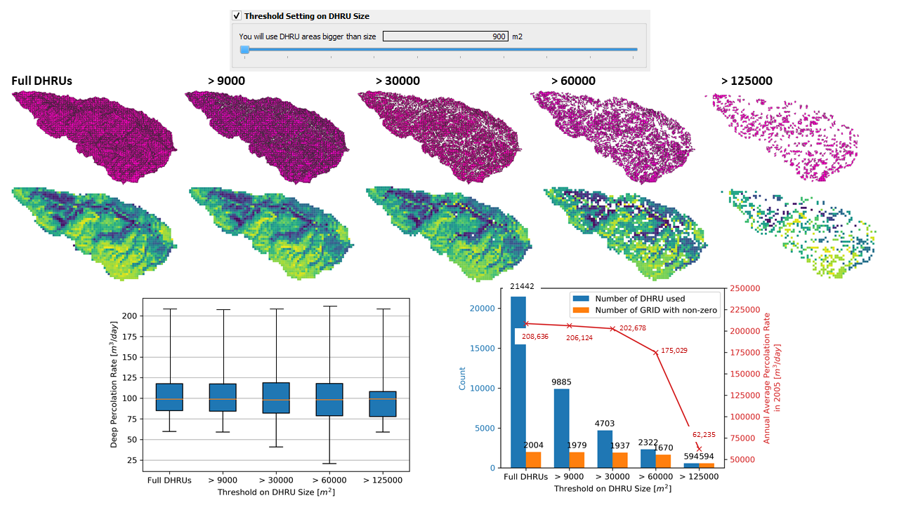

#  &nbsp; QSWATMOD2

#### :exclamation: ***Note:*** `QSWATMOD2 is compatible with QGIS3.`

[QSWATMOD](https://swat.tamu.edu/software/swat-modflow/) is a QGIS-based graphical user interface that facilitates linking SWAT and MODFLOW, running SWAT-MODFLOW simulations, and viewing results.  

This repository contains source codes and an executable for the new version of QSWATMOD.
All other materials: example dataset and tutorial document can be downloaded from the old version of QSWATMOD repository.
- **[Installer](https://github.com/spark-brc/QSWATMOD2/tree/master/Installer):** QSWATMOD 2.0.exe
- **[Inputs](https://github.com/spark-brc/QSWATMOD2/tree/master/Inputs):** ExampleDataset.zip
- **[Source Code](https://github.com/spark-brc/QSWATMOD2/tree/master/QSWATMOD2)**
- **[Tutorial Document](https://github.com/spark-brc/qswatmod/blob/master/QSWATMOD%20Tutorial.pdf)**

-----
# Installation
The QGIS3 software must be installed on the system prior to the installation of QSWATMOD2. We've tested QSWATMOD2 with the "latest release" (3.12.2) and  “long term release (LTR)” (3.10.4 ~ 3.10.5) versions of QGIS3.

- Install one of the versions of QGIS. It can be downloaded from https://qgis.org/en/site/forusers/download.html.
- Download [the QSWATMOD installer](https://github.com/spark-brc/QSWATMOD2/raw/master/Installer/QSWATMOD2.exe) and install it by running QSWATMOD 2.0.exe or a later version. The QSWATMOD2 is installed into the user's home directory *(~\AppData\Roaming\QGIS\QGIS3\profiles\default\python\plugins\QSWATMOD2)*, which we will refer to as the QSWATMOD2 plugin directory.

    

    

QSWATMOD2 includes all dependencies ([FloPy](https://www.usgs.gov/software/flopy-python-package-creating-running-and-post-processing-modflow-based-models) ([Bakker et al., 2016](https://onlinelibrary.wiley.com/doi/abs/10.1002/hyp.10933)) and [PyShp](https://pypi.org/project/pyshp/)) directly in the plugin to avoid user-installation.  
- Open QGIS3 after the installation of QSWATMOD2 is finished.

If you don't see QSWAMOD2 icon on the toolbar,
- Go to Plugins menu and open Manage and Install Plugins

    

- Click the installed tab and check QSWATMOD2 box to activate the plugin.

    

Now, you will see the QSWATMOD2 icon on the toolbar.

    

 

# New features added to QSWATMOD2

There are two additional features in QSWATMOD2.
- ### Add or subtract rows and columns  
    The "Create grid" algorithm in QGIS uses a given spatial extent and not the number of rows and columns. Thus, the algorithm occasionally creates more number of column or row, or less number of them. Once a MODFLOW grid is created, first check the number of columns and rows by labeling 'col' or 'row' on the 'mf_grid' layer.  
    For example, I want to create a MODFLOW grid with 700 m by 700 m grid cells for a given subbasin extent (**same as MODFLOW option 2** in linking process), resulting in one column too few in the MODFLOW grid. I can then use the “Add or Subtract Row and Column” option to add one column.
    

        
    

- ### Threshold setting on DHRU size

    During the linking process, disaggregating HRUs often generates a large number of very small DHRUs. These DHRUs then are intersected with the MODFLOW grid cells, to provide a connection between HRU variables and MODFLOW grid cells during the SWAT-MODFLOW simulation ([Bailey et al., 2016](https://onlinelibrary.wiley.com/doi/abs/10.1002/hyp.10933)). For a large SWAT-MODFLOW models, these small DHRUs are insignificant in terms of passing data (e.g. recharge) from SWAT HRUs to MODFLOW grid cells,  but can slow down the linkage process and SWAT-MODFLOW simulation speed.
     
    
    Therefore, QSWATMOD now has the option to limit the size of DHRUs. The threshold setting on DRHU size option has been tested with an example data set. We tested several threshold settings on DHRU size using full DHRUs (no threshold), and DHRUs that must be > 9000, > 30000, > 60000, and > 125000 m2. The following figures show differences in spatial coverage that results in using different threshold settings. A proper threshold setting on DHRU size may speed up the linking process and the SWAT-MODFLOW simulation without losing information (e.g. recharge rate).
     
    

        
    

 
 

In addition, [documentation and the SWAT-MODFLOW executable](https://swat.tamu.edu/software/swat-modflow/) are available as downloads. QSWATMOD and SWAT-MODFLOW have been tested in several watersheds. However, no warranty is given that either the model or tool is error-free. If you encounter problems with the model, tool or have suggestions for improvement, please comment at [the SWAT-MODFLOW Google group](https://groups.google.com/forum/?hl=en#!forum/swat-modflow) or [QSWATMOD github](https://github.com/spark-brc/QSWATMOD2/issues).

A publication documenting QSWATMOD and an example application can be found here:  
[https://doi.org/10.1016/j.envsoft.2018.10.017](https://doi.org/10.1016/j.envsoft.2018.10.017)

# References
[Bailey, R.T., Wible, T.C., Arabi, M., Records, R.M. and Ditty, J., 2016. Assessing regional‐scale spatio‐temporal patterns of groundwater–surface water interactions using a coupled SWAT‐MODFLOW model. Hydrological processes, 30(23), pp.4420-4433, https://doi.org/10.1002/hyp.10933.](https://onlinelibrary.wiley.com/doi/abs/10.1002/hyp.10933)

[Bakker, M., Post, V., Langevin, C. D., Hughes, J. D., White, J. T., Starn, J. J. and Fienen, M. N., 2016, Scripting MODFLOW Model Development Using Python and FloPy: Groundwater, v. 54, p. 733–739, doi:10.1111/gwat.12413.](https://ngwa.onlinelibrary.wiley.com/doi/full/10.1111/gwat.12413)